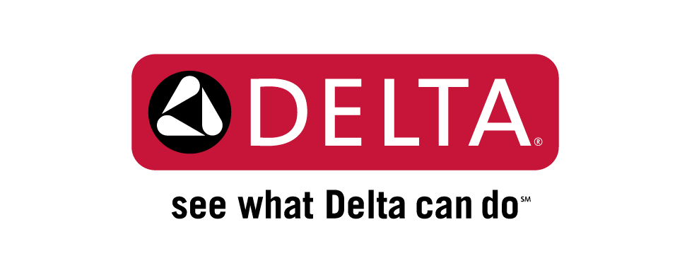

# Homebridge Delta VoiceIQ Faucet Plugin

This plugin allows you to control a [Delta VoiceIQ Faucet](https://www.deltafaucet.com/voiceiq) via homebridge. 

## Limitations
- Only works with "legacy" faucets (if you have an extra v2 faucet laying around feel free to send it to me)
- Only allows the faucet to turn on and off due to homekit limitations for faucets
- Does not actively update status of faucet because Delta's API does not provide that information

## Setup

First you will need to obtain an access token for your Delta VoiceIQ account. To do this, log in at https://device.legacy.deltafaucet.com/

After logging in, type the following into your URL bar to get an access token:

    javascript:prompt("Your Token:",window.localStorage.auth_token)
